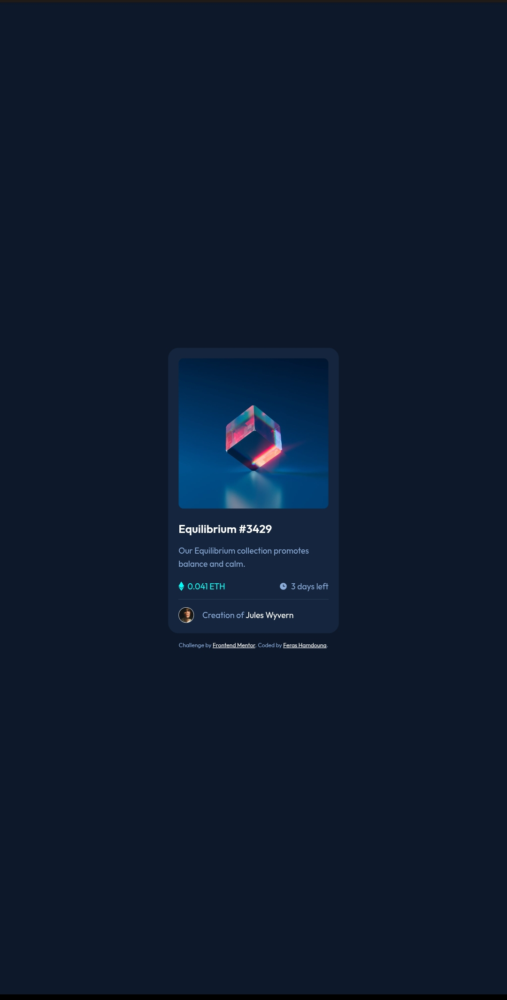

# NFT Preview Card Component Solution

This is a solution to the [NFT preview card component challenge on Frontend Mentor](https://www.frontendmentor.io/challenges/nft-preview-card-component-SbdUL_w0U).

## Table of contents

- [Overview](#overview)
  - [The challenge](#the-challenge)
  - [Screenshot](#screenshot)
  - [Links](#links)
- [My process](#my-process)
  - [Built with](#built-with)
- [Author](#author)

## Overview

### The challenge

Users should be able to:

- View the optimal layout depending on their device's screen size.
- See hover states for interactive elements.

### Screenshot

      

### Links

- Solution URL: [View the solution on Frontend Mentor](https://www.frontendmentor.io/solutions/responsive-nft-preview-card-using-html-and-css-with-flexbox-_UyafJTPbN)
- Live Site URL: [View Live Site](https://ferashamdouna.github.io/nft-preview-card-component/)

## My process

### Built with

- Semantic HTML5 markup
- CSS custom properties
- Flexbox
- CSS Grid
- Mobile-first workflow

## Author

- GitHub - [@FerasHamdouna](https://github.com/FerasHamdouna)
- Frontend Mentor - [@FerasHamdouna](https://www.frontendmentor.io/profile/FerasHamdouna)
